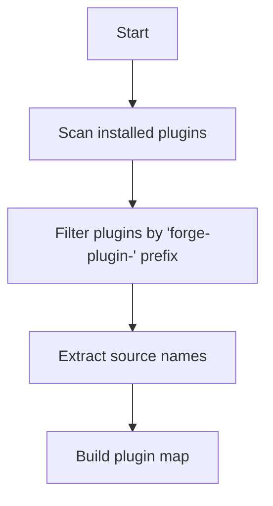
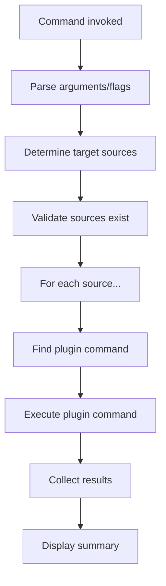

# Architecture

Understanding the internal architecture of TTRPG Data Forge.

## Overview

TTRPG Data Forge is built on top of [oclif](https://oclif.io), a powerful CLI framework. It uses a plugin-based architecture to support extensibility while maintaining a consistent interface.

## Core Components

### 1. Base Framework

The core framework provides:
- Command-line interface handling
- Plugin discovery and loading
- Common utilities and base classes
- Configuration management

### 2. Plugin System

Plugins extend the framework with source-specific functionality:
- Each plugin is a separate npm package
- Plugins follow the `forge-plugin-{sourcename}` naming convention
- Plugins are dynamically loaded at runtime

### 3. Command Structure

Commands are organized in a hierarchical structure:
```
forge
├── collect (base command)
├── plugins (oclif plugin management)
├── help (oclif help system)
└── {plugin-commands} (loaded from plugins)
```

## Class Hierarchy

### RunPluginCommand Base Class

The `RunPluginCommand` class provides common functionality for plugin-related commands:

```typescript
export abstract class RunPluginCommand<T extends typeof Command> extends Command {
  static baseFlags = {
    sources: Flags.string({
      char: 's',
      description: 'comma separated list of sources to use',
      required: false,
    }),
  }

  // Plugin discovery methods
  public getAvailableSourcePluginNames(): string[]
  public getAvailableSourceNames(): string[]
  public extractSourceNameByPluginName(pluginName: string): string | null
  
  // Plugin interaction methods
  public getPluginCommandId(pluginName: string, action: string): string | undefined
  public getSourcePluginNameBySource(source: string): string | null
  public pluginExistsForSourceName(source: string): boolean
}
```

### Command Implementation

Commands extend the base class and implement specific functionality:

```typescript
export default class Collect extends RunPluginCommand<typeof Collect> {
  static override description = 'collects data for all source plugins'
  
  public async run(): Promise<void> {
    // Implementation specific to collect command
  }
}
```

## Plugin Discovery

### Plugin Naming Pattern

Plugins are discovered using the naming pattern: `forge-plugin-*`

### Source Name Extraction

Source names are extracted from plugin names using regex:
```typescript
const match = pluginName.match(/.*forge-plugin-(.*)/)
return match ? match[1] : null
```

Examples:
- `forge-plugin-5etools` → `5etools`
- `forge-plugin-dndbeyond` → `dndbeyond`
- `forge-plugin-pathfinder-2e` → `pathfinder-2e`

## Command Execution Flow

### 1. Plugin Discovery Phase



### 2. Command Execution Phase



## Data Flow

### Collection Phase

1. **Plugin Discovery**: Identify available source plugins
2. **Source Selection**: Determine which sources to collect from
3. **Command Execution**: Run collect commands for each plugin
4. **Data Storage**: Plugins store data in their preferred format/location

### Generation Phase

1. **Data Loading**: Plugins load previously collected data
2. **Processing**: Transform data according to generation parameters
3. **Output**: Generate files in requested format and location

## Configuration Management

### Framework Configuration

The framework uses oclif's configuration system:
- Plugin discovery and loading
- Command registration
- Help system integration

### Plugin Configuration

Plugins manage their own configuration:
- Environment variables
- Configuration files
- Command-line flags

## Error Handling

### Framework Level

- Plugin loading errors
- Command parsing errors
- System-level failures

### Plugin Level

- Source-specific errors
- Data validation errors
- Network/IO errors

## Extensibility Points

### 1. Custom Commands

Plugins can add any number of custom commands:
```typescript
// In plugin: forge-plugin-5etools
export default class Generate extends Command {
  static id = '5etools:generate'
  // Command implementation
}
```

### 2. Shared Utilities

Common functionality can be shared through:
- Base classes (like `RunPluginCommand`)
- Utility packages
- Configuration patterns

### 3. Hook System

oclif provides hooks for extending behavior:
- `init` - Before command execution
- `prerun` - Before running specific command
- `postrun` - After running specific command

## Testing Architecture

### Unit Testing

- Individual command testing
- Plugin method testing
- Utility function testing

### Integration Testing

- Plugin discovery testing
- Command execution flow testing
- End-to-end workflow testing

### Plugin Testing

- Plugin-specific command testing
- Data collection/generation testing
- Error handling testing

## Build and Distribution

### Framework Build

```typescript
// TypeScript compilation
tsc -b

// Post-build processing (import fixing)
node scripts/fix-imports.js
```

### Plugin Distribution

- Plugins are separate npm packages
- Independent versioning and releases
- Dynamic loading at runtime

## Performance Considerations

### Plugin Loading

- Lazy loading of plugins
- Command discovery caching
- Minimal startup overhead

### Parallel Execution

- Concurrent plugin command execution
- Promise-based async operations
- Error isolation between plugins

## Security Considerations

### Plugin Isolation

- Plugins run in the same process but with defined interfaces
- No direct access to framework internals
- Command-based interaction only

### Data Handling

- Plugins responsible for their own data security
- No central data storage
- Environment variable based configuration

## Future Architecture Enhancements

### Planned Improvements

1. **Plugin Sandboxing**: Isolate plugin execution
2. **Central Data Store**: Optional shared data storage
3. **Plugin Registry**: Centralized plugin discovery
4. **Configuration UI**: Web-based configuration interface
5. **Monitoring**: Plugin execution monitoring and logging
